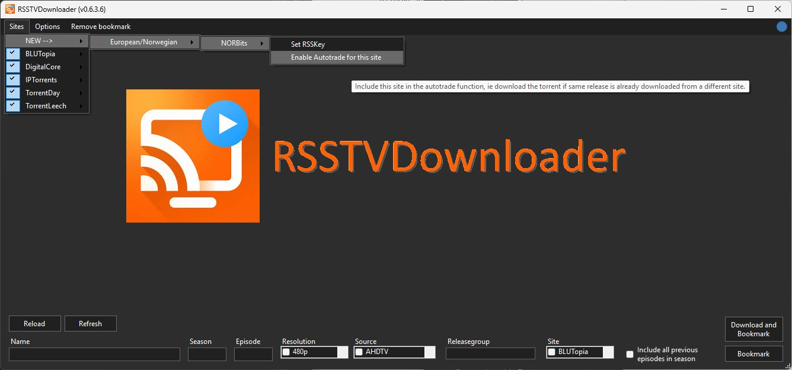
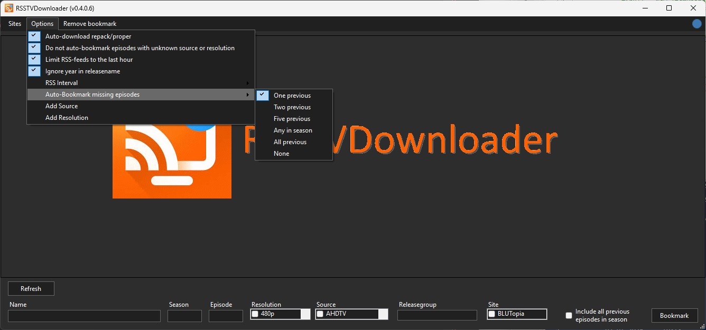
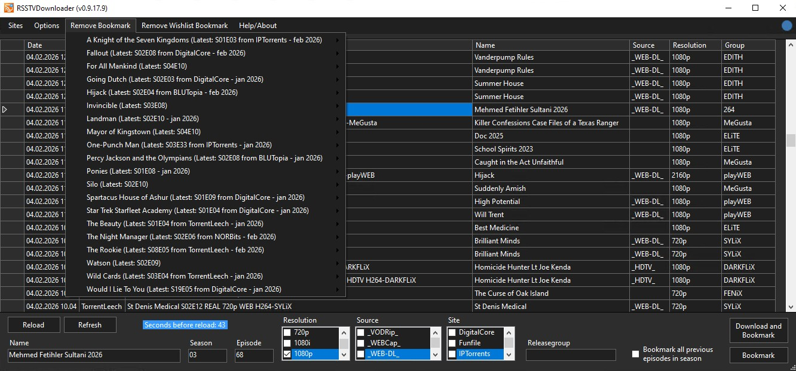
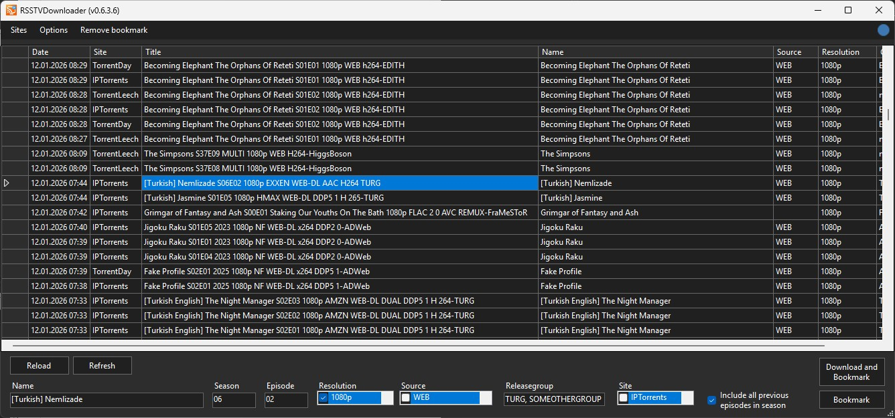

RSSTVDownloader may be viewed as a poor-man's Sonarr, with a mini-Radarr included. It does not aim to compete with the forementioned apps, but rather be a quick solution for the people just needing the basic features. There's very few bells and whistles with this app, and thus few options. The focus is more a WYSIWYG approach with a point-and-click GUI. Thus, it can be up and running within minutes.

By default the app starts in safe-mode (called Dry-run) where everything is simulated except actually sending the downloaded .torrent files to the torrent client. Should be safe to test without worry.

So, what can it do?

Basically, the small gui-app replaces adding filters and regex to rss-feeds in you torrent client.
features include:
 - point and click bookmarks for tv-shows
 - auto-downloading and opening .torrent files
 - auto-downloading out-of-order episode-releases
 - auto-downloading the same release from different sites/feeds (auto-trading - should be used with care)
 - auto-downloading of repacks/propers
 - auto-downloading of personal bookmarks from selected sites
 - auto-downloading of wishlist bookmarks (sort of like what radarr does, but not limited to movies)

Please note: <b>TV-series are recognized wih having season&episode markers</b> (S{number}E{number} or {number}E{number} or {number}X{number}) <b>in the title. TV-series annoted with dates instead of season&episode is not recognized and will not be eligble for bookmarking</b>.

Work in progress. No more features will be added, only bugfixes. Awaiting v1 release.

<a href="./bin/x64/RSSTVDownloader.exe" download>Windows exe</a> can be found in the bin/x64 directory and the <a href="./RSSTVDownloader.ps1" download>powershell sourcecode</a> in the root directory.
A separate script <a href= "./CreateSiteConfig.ps1" download>CreateSiteConfig.ps1</a> can be used to add your own sites. Please send any working config my way so I can add it to the script.

The following sites are recognized (more can be added by request):
 - TL
 - NB
 - BLU
 - TD
 - IPT
 - DC
 - FF
 - RTT

Requirements:
  - Windows 11
  - Powershell 5 (included in OS)

Powershell modules used (all included in Powershell 5 by default):
  - Microsoft.PowerShell.Utility 3.1.0.0
  - Microsoft.PowerShell.Management 3.1.0.0
  - Microsoft.PowerShell.Core 3.0.0.0

App must run on the same computer as your torrent client.
No admin privileges required.

Expected behavior:
  - Creation and updating of content in the <b>HKCU:\Software\RSSTVDownloader</b> registry key
  - Creation of RSSTVDownloader_DATE.cmtrace.log files in the %temp% directory. These will be removed by the app after 7 days.
  - Creation of RSSTVDownloader_DATEANDTIME.torrent files in the %temp% directory. These will be automatically removed when >24 hours has passed.
  - Internet-traffic is limited to fetching of RSS-feeds and .torrent files from sites. There should be no other forms of external communication.

License:
  - None. Feel free to use and abuse as you see fit. There's no restrictions.

Warranty:
  - None. Use this at your own risk. The testing done has not yet resulted in a melted computer, but no guarantees are given!

VirusTotal Scan:
  - https://www.virustotal.com/gui/url/896468e582ef5721171209722079c3fd9b0e4634c6253f833d13cc332a4d82a7

Screenshots:

